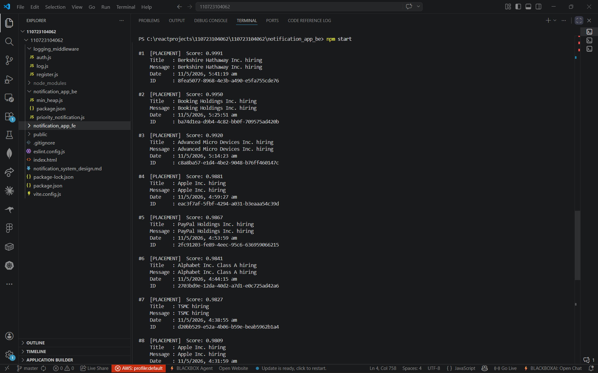
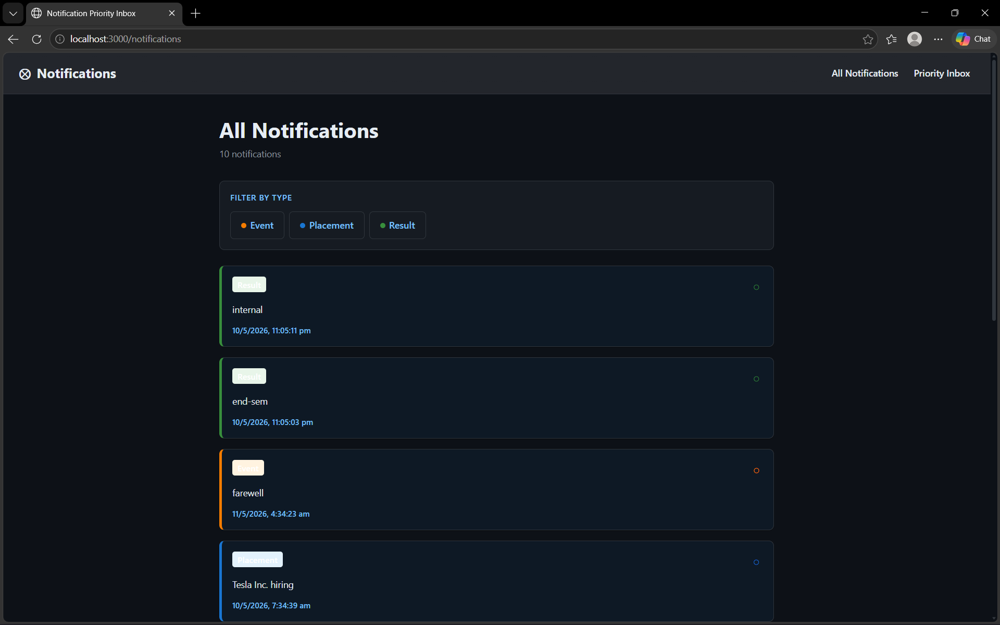
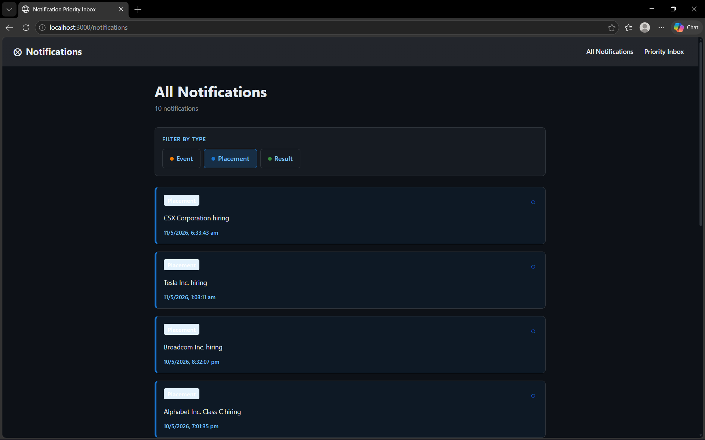
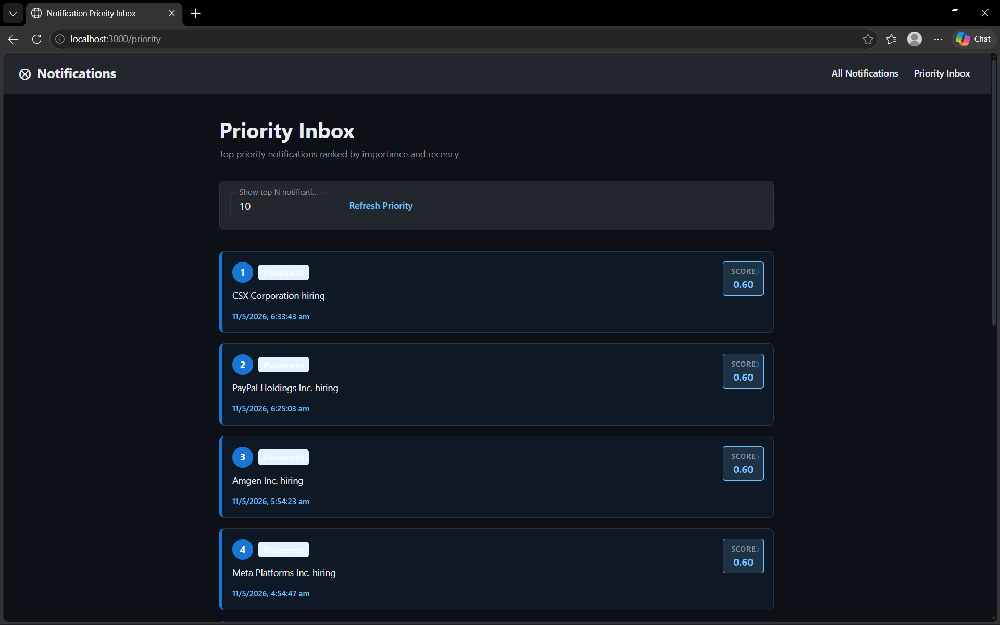

# Notification System Design

A two-stage notification prioritization system that ranks campus notifications using **type importance** and **recency**, then showcases them through a responsive frontend with read/unread tracking, filtering, and a Priority Inbox.

## Overview

This project is built in two stages:

- **Stage 1** focuses on efficient notification prioritization using a scoring formula and a **Min-Heap** for top-N retrieval.
- **Stage 2** focuses on a responsive React frontend that displays all notifications and the priority inbox with filtering, ranking, and read-state management.

The goal is to ensure students always see the most critical, time-sensitive campus notifications first.

***

## Output Showcase

> Store your screenshots inside a stable repository folder such as `images/` or `screenshots/` and update the file names below if needed.

### All Notifications View

**Mixed Types**  


**Placement Filter**  


### Priority Inbox

**Ranked Notifications**  


### Optional: CLI Output (Stage 1)

If you have a terminal screenshot of Stage 1 output, add it here:


***

## Stage 1

### Overview

The Priority Inbox feature ensures students always see the most critical notifications first by scoring every notification on two axes:

- **Type importance**
- **Recency**

To efficiently maintain the top-N results, the backend uses a **Min-Heap**, enabling **O(log N)** streaming updates.

### Priority Scoring Formula

```text
priority_score = (type_weight / MAX_WEIGHT) × TYPE_FACTOR
               + recency_norm               × RECENCY_FACTOR
```

| Variable | Value | Rationale |
|----------|-------|-----------|
| `TYPE_FACTOR` | 0.60 | Type dominates as a stronger and more predictable signal |
| `RECENCY_FACTOR` | 0.40 | Recency matters but should not overpower type |
| `MAX_WEIGHT` | 3 | Normalizes type weight to the range [1] |

#### Type Weights

| Type | Weight | Reason |
|------|--------|--------|
| Placement | 3 | Career-critical and directly affects student opportunities |
| Result | 2 | Academically significant and time-sensitive |
| Event | 1 | Informational and usually less urgent |

#### Recency Normalisation

```text
recency_norm = (timestamp - oldest_timestamp) / (newest_timestamp - oldest_timestamp)
```

All timestamps in the current batch are normalized to the range [1]. The newest notification scores 1.0 and the oldest scores 0.0. This makes ranking fair within a single fetch window.

### Algorithm — Min-Heap for Top-N

A **Min-Heap of capacity N** is used instead of sorting the full list each time.

#### Why Min-Heap?

| Approach | Initial Build | Per New Notification | Space |
|----------|---------------|----------------------|-------|
| Sort entire list | O(M log M) | O(M log M) per update | O(M) |
| **Min-Heap (size N)** | **O(M log N)** | **O(log N)** | **O(N)** |

#### How it Works

```text
For each incoming notification:
  1. Compute priority_score                  O(1)
  2. If heap.size < N → push directly        O(log N)
  3. Else if score > heap.min → pop + push   O(log N)
  4. Else discard                            O(1)
```

The heap always stores the **N highest-scoring notifications**. The root of the min-heap is the weakest member of the current top-N set.

### Streaming / Real-time Updates

In a production system driven by WebSocket or Server-Sent Events:

```text
WebSocket.onmessage → parse notification → computeScore() → heap.add()
```

This avoids full re-sorting and keeps updates efficient.

### Data Flow

```text
API (GET /notifications?page=&limit=)
        │
        ▼
fetchAllNotifications()
        │
        ▼
computeScore(n, minTs, maxTs)
        │
        ▼
PriorityInbox.add(scoredNotification)
        │
        ▼
heap.toSortedArray()
        │
        ▼
Display top-N
```

### How to Run (Stage 1)

```bash
cd notification_app_be
npm install
cp .env.example .env
# Set API_TOKEN and optionally TOP_N in .env
npm start          # defaults to top 10
npm run top15      # top 15
TOP_N=20 npm start # top 20
```

### Sample Backend Output



***

## Stage 2

### Architecture

```text
notification_app_fe/
├── src/
│   ├── api/
│   │   └── notificationsApi.js     # Axios client, Bearer auth, paginated fetch
│   ├── components/
│   │   ├── Navbar.jsx              # Responsive AppBar + mobile Drawer
│   │   ├── NotificationCard.jsx    # Card with read/unread styling + priority badge
│   │   ├── FilterBar.jsx           # ToggleButtonGroup for type filtering
│   │   └── StateComponents.jsx     # Loading skeleton, Empty, Error states
│   ├── pages/
│   │   ├── AllNotifications.jsx    # Paginated list with filter + per-page control
│   │   └── PriorityInbox.jsx       # Top-N priority view with rank badges
│   ├── utils/
│   │   ├── priorityHelper.js       # Score computation, type config, time formatting
│   │   └── readState.js            # localStorage read/unread tracking
│   ├── theme.js                    # MUI dark theme
│   ├── App.jsx                     # Router + ThemeProvider
│   └── main.jsx                    # React entry point
```

### Pages




#### All Notifications (`/`)

- Pagination via `?page=` and `?limit=` query parameters
- Type filtering through `?notification_type=`
- Per-page selector for 5 / 10 / 15 / 20 items
- Read/unread UI states with visual distinction
- Mark-all-read action for the current page
- Refresh without full page reload
- Navbar unread count badge with reactive updates

#### Priority Inbox (`/priority`)

- Fetches a larger batch for accurate top-N selection
- Uses **client-side** scoring with the same Stage 1 logic
- Top-N selector for 5 / 10 / 15 / 20
- Type filter before ranking
- Rank badges for top positions
- Priority tier chips: Critical / High / Medium / Low
- Monospaced priority score display
- Summary statistics by notification type

### Read/Unread State

Read state is tracked on the frontend using `localStorage` under the key `campus_read_notifications`.

```js
// On card click → markAsRead(id)
// On load → enrichWithReadState(items)
// Unread count → getUnreadCount(items)
```

This avoids backend changes and preserves state across refreshes and browser sessions.

### API Integration

```text
Base URL:  http://4.224.186.213/evaluation-service
Endpoint:  GET /notifications

Query params:
  page
  limit
  notification_type

Auth:
  Authorization: Bearer <VITE_API_TOKEN>
```

The token is loaded from the `VITE_API_TOKEN` environment variable via `.env` and should never be committed to source control.

### Responsive Design

| Breakpoint | Behaviour |
|------------|-----------|
| xs (< 600) | Single-column layout, hamburger menu, icon-first controls |
| sm (600+) | Full filter labels and desktop navigation |
| md (900+) | Content centered with capped max width |

### How to Run (Stage 2)

```bash
cd notification_app_fe
npm install
cp .env.example .env
# Set VITE_API_TOKEN in .env
npm run dev
```

Frontend runs at:

```text
http://localhost:3000
```

***

## Key Design Decisions

| Decision | Rationale |
|----------|-----------|
| Client-side priority scoring in Stage 2 | Avoids extra API endpoints and keeps scoring logic fast and transparent |
| Min-Heap in Stage 1 backend | Ensures O(log N) insertions and efficient top-N maintenance |
| Different recency approaches in FE and BE | FE can favor smoother UI-friendly curves; BE uses simpler batch normalization |
| `localStorage` for read state | Keeps implementation simple and persistent without backend changes |
| MUI dark theme | Improves visual consistency and comfort for frequent scanning |
| Axios interceptor pattern | Centralizes auth handling and simplifies API calls |

***

## Future Improvements

- Backend persistence for read/unread state
- WebSocket or SSE support for live notification streams
- Redis cache for production scale
- User-specific preferences and notification subscriptions
- Push, email, and SMS channel support
- Admin dashboard for notification publishing and analytics
- Retry handling and observability for API failures

***

## Getting Started Summary

### Backend

```bash
cd notification_app_be
npm install
cp .env.example .env
npm start
```

### Frontend

```bash
cd notification_app_fe
npm install
cp .env.example .env
npm run dev
```

Make sure both applications are configured correctly and running together for full functionality.